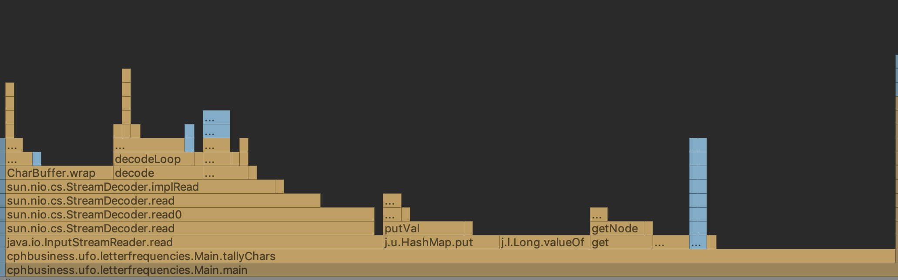
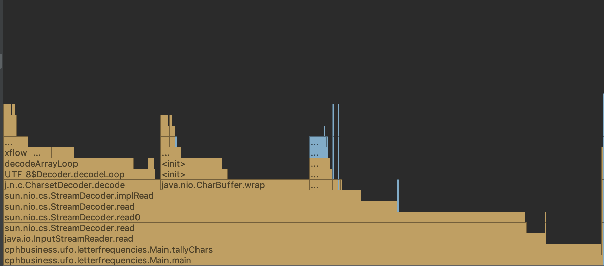
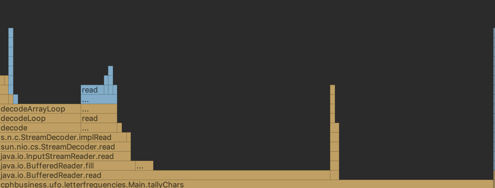
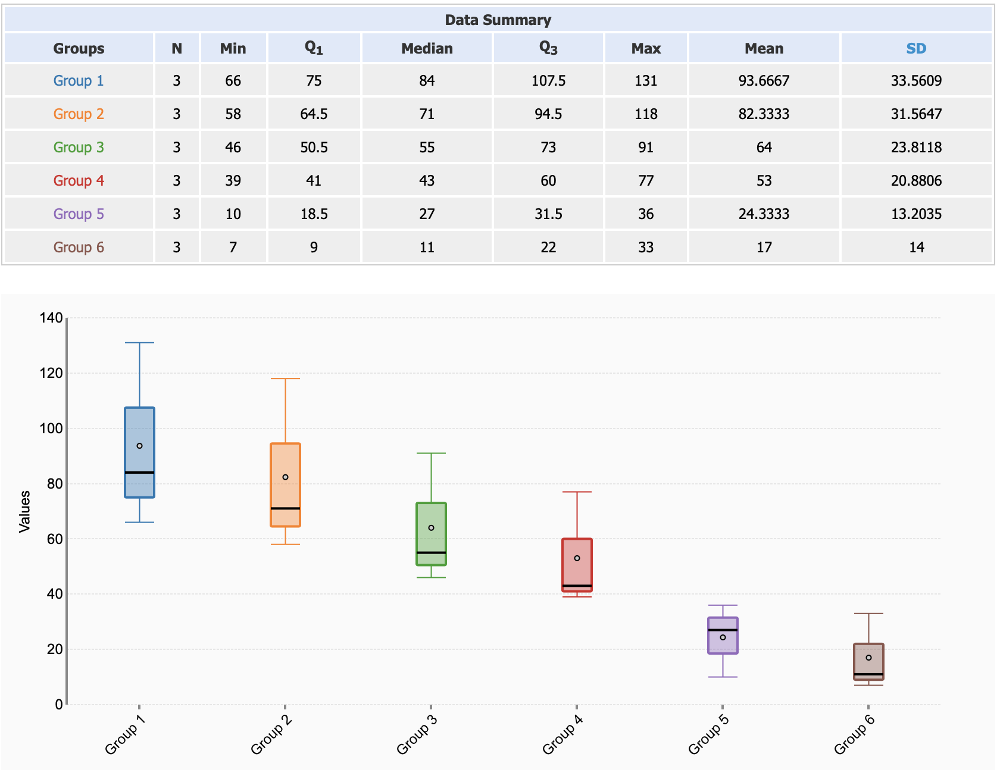
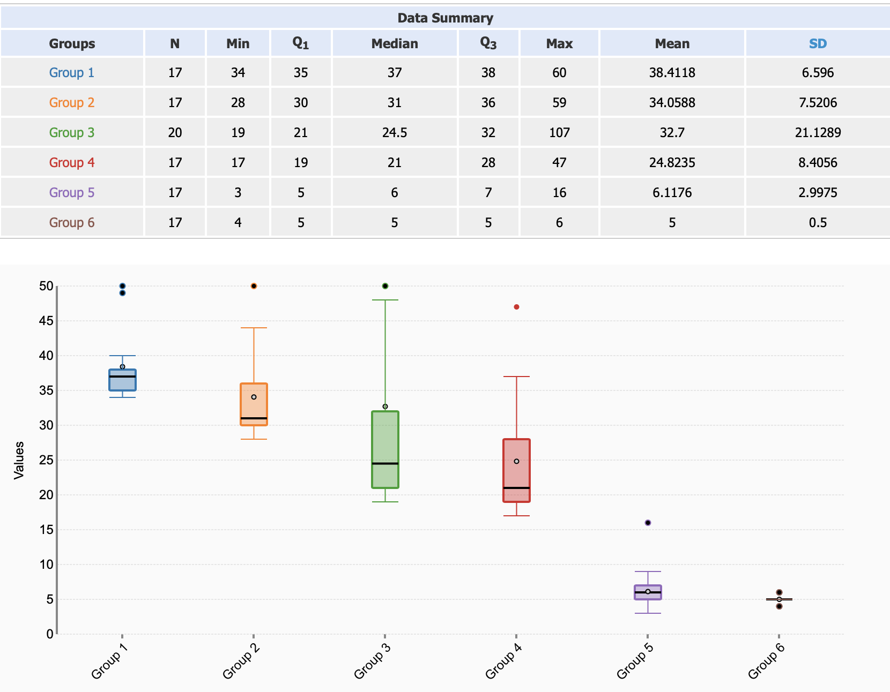

# Letter frequencies

Optimizing the letter counter

The first thing to do before doing anything is to get a baseline and profile it:

All the timings can be found at the bottom.

## Version 1 (original)

The first thing I saw was that a large amount of time was used to reading the file, that one, I wanted to look at later.

The next thing was both that it read and write a lot to the hash map, that has to be addressed.

And the value conversion wasn't great eighter.

The median for the 17 timings after 37 ms, with the first CPU unoptimized run at 131 ms

## Version 2

The first improvement was to prepopulate the hashmap with the possible values, I found no items higher than 128 at the time of debugging, so I prepopulated the hashmap with 128 zeros, and removed the try-catch block:

The median for the 17 timings after 31 ms, with the first CPU unoptimized run at 118 ms

That is 83.7% (first run) / 89.3% (median of run 4-20) of the original time.

## Version 3

Instead of using the hashmap, I used an array instead, still prepopulated with 128 zeros.

With this edit, it skips the step of calculating the hash of the key to using for an index. Now the char-code is the index.

The array is converting back into the hashmap again before the result is returned, this operation is a part of the timings. It could be optimized further, but I did not want to mess with the interface in any of the versions.

The median for the 17 timings after 24.5 ms, with the first CPU unoptimized run at 91 ms

That is 66.2%/69.4% of the original time.

## Version 4

The count of chars is a lot lower than the limit for an int, so int is used, and converted back to long before returning for the same reasons as before.

The median for the 17 timings after 21 ms, with the first CPU unoptimized run at 77 ms

That is 56.8%/58.7% of the original time.

As shown here, the io is now our biggest enemy

## Version 5

I was happy with the algorithm speedup here, time to look at the file io performance, I did find this article https://itnext.io/using-java-to-read-really-really-large-files-a6f8a3f44649 about file performance, and instead of loading in 1 char at the time, it could populate a buffer instead. They showed 2 different options, one with a native file reader function, and one a tiny bit faster from a library, but next to nothing, so I decided to use BufferedReader from the io library. I saw it had 2 options, both read line and read char, I tried here the "read line" function and then split by chars because I could imagine it to be faster, but both things had to be tried.

The median for the 17 timings after 6 ms, with the first CPU unoptimized run at 36 ms

That is 16.2%/27.5% of the original time.

## Version 6

Here, we use read (char) instead of "read line" and splitting in manually

The median for the 17 timings after 5 ms, with the first CPU unoptimized run at 33 ms

That is 13.5%/25.2% of the original time.

And now, I'm happy with the numbers

# Timing results

I moved the first 3 runs of the code into its own visualization because the difference between CPU optimized version and cold run version was so big, both categories are interesting depending on where the code is used.

First 3 runs

Run 4 - 20

